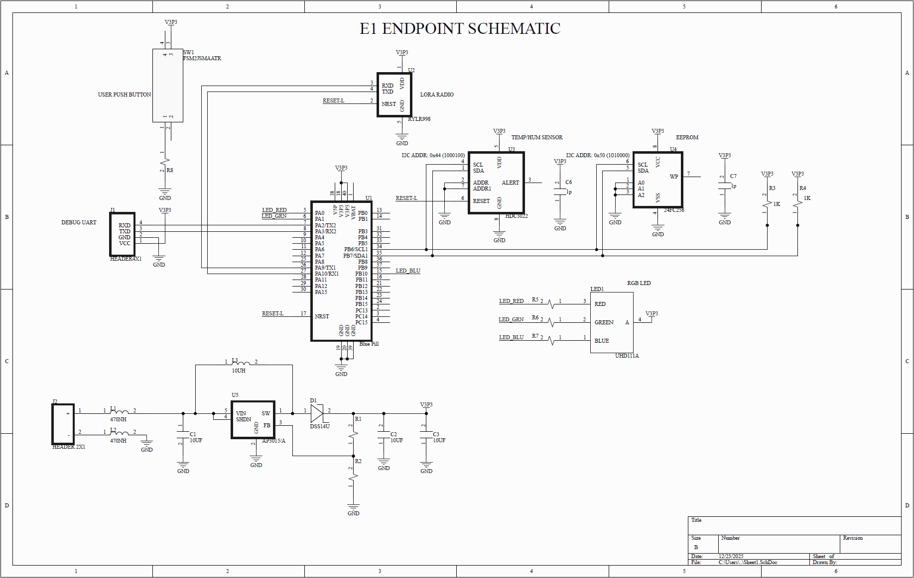

# STM32_LoRa_EnvMonitor

# Introduction
The purpose of this project is to implement a system to monitor remote environmental conditions. The system consists of mutliple remote sensor nodes, a gateway, a cloud service, and a mobile user application. Battery powered Sensor nodes monitor temperature, and transmit data using LoRa radio to a wall powered gateway. The gateway then puts data on a cloud service where it becomes avaiable to the mobile user application.

# Description
This repository contains the firmware and hardware implementation of the remote sensor nodes, it does not include the implementation of the gateway, cloud service, or mobile user application. The environmental monitoring nodes are implemented with a battery powered STM32F103C8T6 low power MCU, connecting over I2C to a TI HDC3022 sensor to collect temperature and humidity data. This data is relayed through UART to a LoRa module which transmits environmental data from nodes to a central gateway. 

With an emphasis on battery life of sensor nodes, the MCU runs in the lowest power operating mode, with an interrupt driven wakeup routine to enable the processor, make measurements, and transmit to the gateway. With a frequency of one transmission every 6 minutes, the sensor nodes have an estimated battery life of >1 year via 2 AA batteries. 

# Features
- Low-power interrupt driven firmware.
- Sensor nodes battery life >1 yr.
- Optimized BoM for high volume production.

# Pictures

# Conclusion
This project consists an environmental monitoring system which transmits from sensor nodes to a central gateway that provides environmental data to a cloud service. The implementation of the gateway, cloud service, and end user application are not detailed in this repository.

# References

[LoRa Module](https://reyax.com/products/RYLR998) 

[TI HDC3022 Temperature/Humidity sensor](https://www.ti.com/product/HDC3022-Q1)

[STM32F103C8T6 Datasheet](https://www.st.com/resource/en/datasheet/stm32f103cb.pdf)
  
